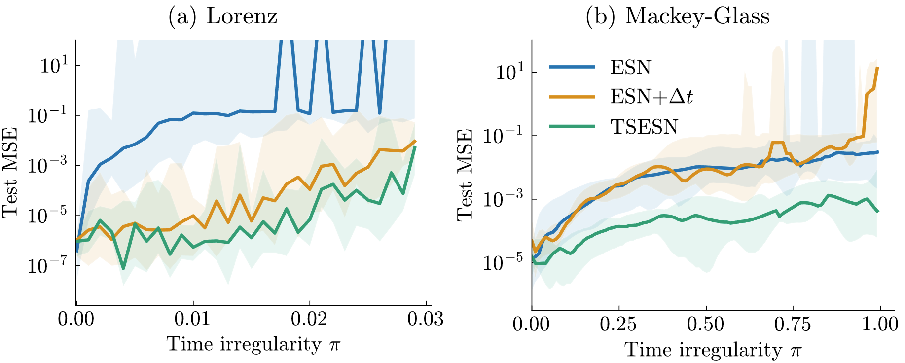
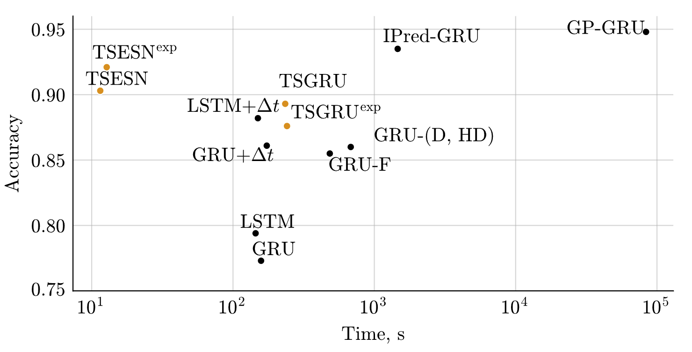

## Task-Synchronized Recurrent Neural Networks

Official implementation of Task-Synchronized RNNs for handling irregular time series data.

## Overview
 
- Adapts RNN dynamics to variable time steps
- Works with ESNs and GRUs
- No data resampling or extra parameters needed

## How It Works

1. We derive RNNs as discretizations of continuous-time dynamical systems
2. Instead of fixed time steps, we use variable Δt from the data
3. For TSESNs:

   h<sub>n</sub> = (1 - αΔt<sub>n</sub>)h<sub>n-1</sub> + αΔt<sub>n</sub> σ(Wx<sub>n</sub> + Uh<sub>n-1</sub>)

4. For TSGRUs:

   h<sub>n</sub> = (1 - Δt<sub>n</sub> z<sub>n</sub>) ⊙ h<sub>n-1</sub> + (Δt<sub>n</sub> z<sub>n</sub>) ⊙ σ(Wx<sub>n</sub> + U(r<sub>n</sub> ⊙ h<sub>n-1</sub>))

5. Optional nonlinear scaling of Δt for handling large time gaps

This approach synchronizes the RNN's internal dynamics with the task's natural timing.

## Installation

```bash
git clone https://github.com/your-username/task-synchronized-rnns.git
cd task-synchronized-rnns
pip install -r requirements.txt
```

## Repruducing results

For reproducing experiments, we provide training and inference scripts for the Mackey-Glass time series and Lorenz attractor
for ESN and its variants. For real-world datasets, we provide training and inference scripts for UWaveGesture and <Cave> datasets for ESN and GRU models and their task-synchronized variants.


### Synthetic data

The provided scripts fixes a set of parameters for the model (found for the vanilla ESN) and varies the time-irregularity parameter; then, for each value of the time-irregularity parameter, the model is retrained by varying the seed for the initialization of the model. The results are saved and can then be plotted using the provided plotting scripts.

```bash
''' 
Mackey-Glass, using fixed hyperparameters of
   resSize = 500
   a = 0.4
   eigen_scaling = 1
   reg = 1e-7
'''  

cd synthetic
# runs Vanilla ESN, TSESN, and ESN+Δt 
bash reproduce_mackey_glass.sh
```
```bash
''' 
Lorenz attractor, using fixed hyperparameters of
   resSize = 500
   a = 0.3  # leaking rate
   eigen_scaling = 0.2
   reg = 1e-7
'''
cd synthetic
# runs Vanilla ESN, TSESN, and ESN+Δt
bash reproduce_lorenz.sh
```

The results can then be visualized using `synthetic/make_figure.py` (you might need to update the paths of the saved results in the script); this should yield the following figure. 


### Real-World data   
We provide an examplary script for the UWaveGesture dataset using the TSESN model. Run `python real_world/uwave/uwave_tsesn.py` to replicate the results. This should replicate the result of TSESN from the figure in the paper:


 
## Reference
```bibtex
@article{lukovsevivcius2022time,
  title={Time-adaptive recurrent neural networks},
  author={Luko{\v{s}}evi{\v{c}}ius, Mantas and Uselis, Arnas},
  journal={arXiv preprint arXiv:2204.05192},
  year={2022}
}
```